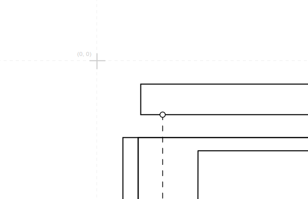

# diagram-js-origin

A point of origin cross and contour for diagram-js.

## Configure Border

The plug-in will render an optional border to contour the positive coordinate space.
Remove the border by providing a `config.origin.showBorder=false` entry.

## License

MIT